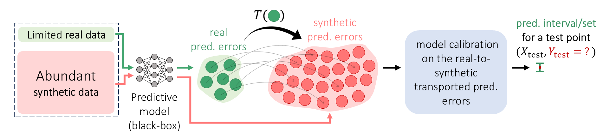
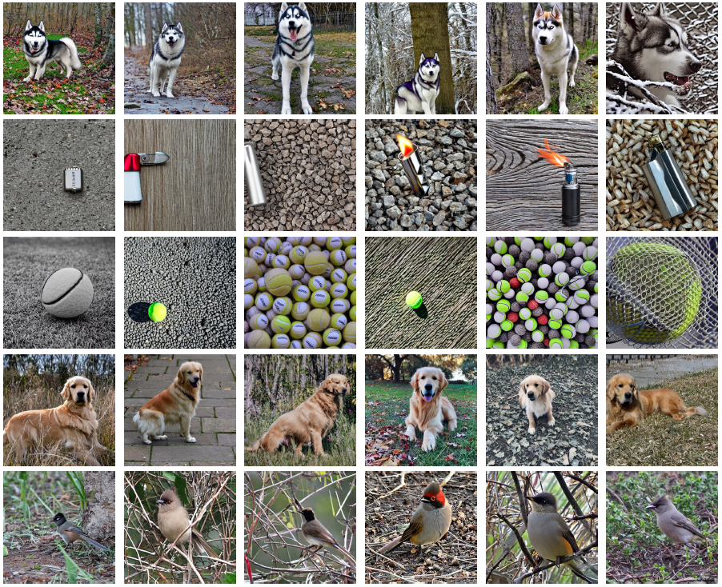

# Synthetic-Powered Predictive Inference


This repository contains a Python implementation of the following paper: ["Synthetic-Powered Predictive Inference."](https://arxiv.org/abs/2505.13432)
The repository includes an implementation of the proposed *SPPI* and *SPPI-Subset* methods.
Baseline methods implementation alongside code for real data experiments are included in this repository.


---

## **📖 Abstract**  <a name="abstract"></a>

Conformal prediction is a framework for predictive inference with a distribution-free, finite-sample guarantee. However, it tends to provide uninformative prediction sets when calibration data are scarce. 
This paper introduces Synthetic-powered predictive inference (SPPI), a novel framework that incorporates synthetic data—e.g., from a generative model—to improve sample efficiency. At the core of our method is a score transporter: an empirical quantile mapping that aligns nonconformity scores from trusted, real data with those from synthetic data. By carefully integrating the score transporter into the calibration process, SPPI provably achieves finite-sample coverage guarantees without making any assumptions about the real and synthetic data distributions.
When the score distributions are well aligned, SPPI yields substantially tighter and more informative prediction sets than standard conformal prediction. Experiments on image classification and tabular regression demonstrate notable improvements in predictive efficiency in data-scarce settings.

---

## **📚 Table of Contents**  
- [📖 Abstract](#abstract)
- [📌 Usage Instructions](#usage)
  - [🔹 Setting Up a Conda Environment](#conda)
  - [📁 Generating Synthetic Images and Model Predictions](#generating)
    - [🖼️ Generating Synthetic Images](#images)
    - [📈 Generating Model Predictions](#scores)
  - [🧪 Running Experiments](#run)
  - [📊 Additional Plotting](#plots)
- [📜 License](#license)
- [:books: Citation](#cite)

---

## **📌 Usage Instructions**  <a name="usage"></a>

---

### **🔹 Setting Up a Conda Environment**  <a name="conda"></a>
To install dependencies, create a Conda environment using `sppi/requirements.yml`:  
```
conda env create -f sppi/requirements.yml
conda activate sppi
```

---

### **📁 Generating Synthetic Images and Model Predictions**  <a name="generating"></a>

We provide precomputed model predictions in the `data/` directory for both the ImageNet and MEPS experiments.
- **ImageNet**: Includes predictions on both real and synthetic images, where synthetic images were generated using FLUX and Stable Diffusion.
- **MEPS**: Contains predictions from a trained quantile regression model, computed across multiple α levels.

In addition, we provide the code for generating synthetic images and producing model predictions.

#### **🖼️ Generating Synthetic Images**  <a name="images"></a>
To generate synthetic images, use the script: `sppi/scripts/generate_images/generate_<MODEL>_images.py`.
You can select between two generative models: Stable Diffusion v1.5 and FLUX v1.

**Examples:**

Stable-Diffusion v1.5:



FLUX.1:


#### **📈 Generating Model Predictions**  <a name="scores"></a>
- For **ImageNet**, use the script:
`sppi/scripts/generate_scores/generate_scores_clip_<synth/real>.py`
This script uses a pre-trained CLIP model to compute predictions on real or synthetic images.
ד
- For **MEPS**: 
To get MEPS dataset please follow the instruction of:
`sppi/scripts/get_meps_data/README.md` originally written by [CQR](https://github.com/yromano/cqr/blob/master/get_meps_data/README.md). Then use the script:
`ppi/scripts/generate_scores/generate_scores_meps.py`
This script trains a quantile regression model and generates predictions at specified α levels.

---

### **🧪 Running Experiments**  <a name="run"></a>
Once you have generated and saved the model predictions, you're ready to run experiments!

To run experiments, use the script `sppi/run_exp.py`, which executes experiments based on a YAML configuration file.
If any parameter in the config file is specified as a list (except for `alpha` and `methods`), the script will automatically run experiments for **all combinations** of those parameters.

You can override any parameter directly via the command line.

**Examples**:

Run ImageNet experiment with generated images:
```
python sppi/run_exp.py -c ./config_files/imagenet_clip_marginal.yml -s ./results/results_marginal/ distribute=True num_processes=100

python sppi/run_exp.py -c ./config_files/imagenet_clip_class_cond.yml -s ./results/results_class_cond/ distribute=True num_processes=100
```

Run MEPS experiment for the 20-40 age range:
```
python sppi/run_exp.py -c ./config_files/meps_regression_ages_20_to_40.yml -s ./results/results_meps/ distribute=True num_processes=100
```
#### **🔹 Parallel Execution**
To run an experiment in parallel, use the arguments `distribute=True` and `num_process=N`, where N is the number of threads.
Each thread will the run experiment with a different random seed.

#### **🔹 Available Configuration Files**  
Here are some example config files you can use to run experiments:
- `config_files/imagenet_clip_marginal.yml`
- `config_files/imagenet_clip_class_cond.yml`
- `config_files/imagenet_clip_marginal_subset_exp.yml`
- `config_files/imagenet_clip_class_cond_subset_exp.yml`
- `config_files/meps_regression_ages_0_to_20.yml`
- `config_files/meps_regression_ages_20_to_40.yml`
- `config_files/meps_regression_ages_40_to_60.yml`
- `config_files/meps_regression_ages_60_to_100.yml`


#### **📝 Note:** 
Each run creates a directory under `save_path`, named according to the run parameters. Results are saved in `results/results.pkl`, and plots (plus tables for class-conditional experiments) are written to the `plots/` directory.

---

### **📊 Additional Plotting**  <a name="plots"></a>
Once the experiments are complete, use `plot_main.py` to visualize results from different runs:
- Marginal and class-conditional results in a single plot
Example:
```
python plot_main.py --plot_dir ./plots/ --results_dir_cond ./results/results_class_cond/ --results_dir_marg ./results/results_marginal/ --beta 0.4 --alpha 0.05
```

- All age ranges (MEPS dataset) in one plot
Example:
```
python plot_main.py --plot_dir ./plots/ --meps --results_dir ./results/results_meps/ --beta 0.4 --alpha 0.05
```

#### **🔹 Additional Options:**  
- To plot results for the subset experiment, add `--subset_exp k={value}`.
- To filter results before plotting, pass key-values pairs as `key=value`.

---

## **📜 License**  <a name="licence"></a>
This project is licensed under the **CC BY-NC-SA 4.0 License**.

---
## **:books: Citation**  <a name="cite"></a>
If you use this code or ideas from this project in your research, please cite:
```bibtex
@article{bashari2025sppi,
          title={Synthetic-Powered Predictive Inference},
          author={Meshi Bashari and Roy Maor Lotan and Yonghoon Lee and Edgar Dobriban and Yaniv Romano},
          year={2025},
          eprint={2505.13432},
          archivePrefix={arXiv},
          url={https://arxiv.org/abs/2505.13432},
}
```
---
